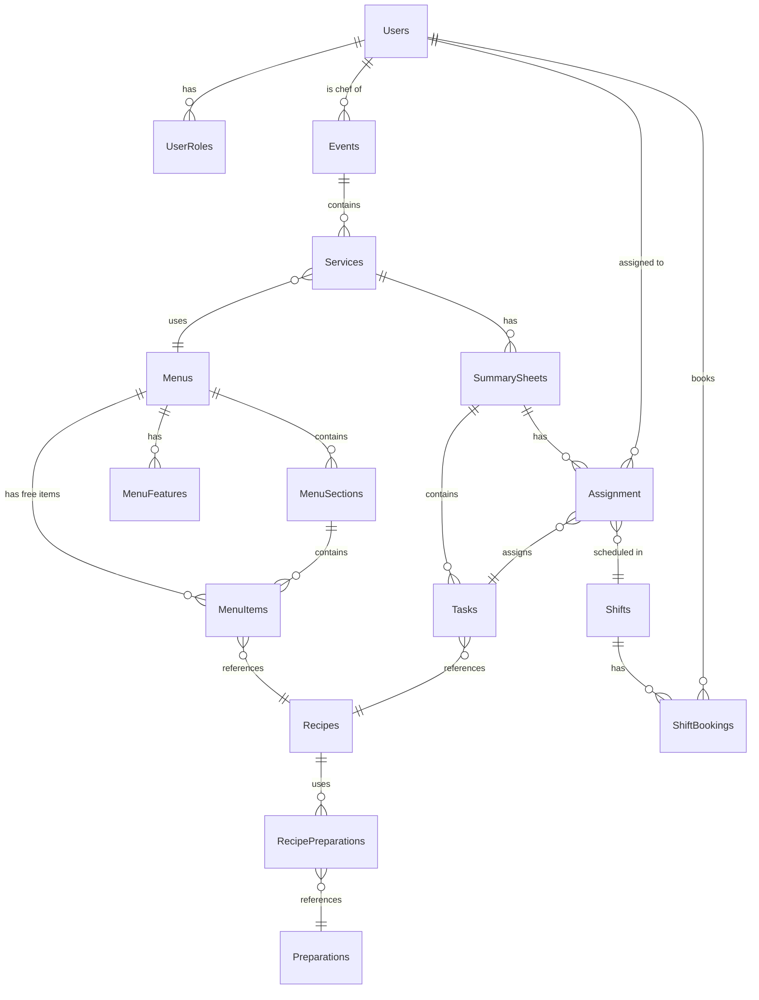
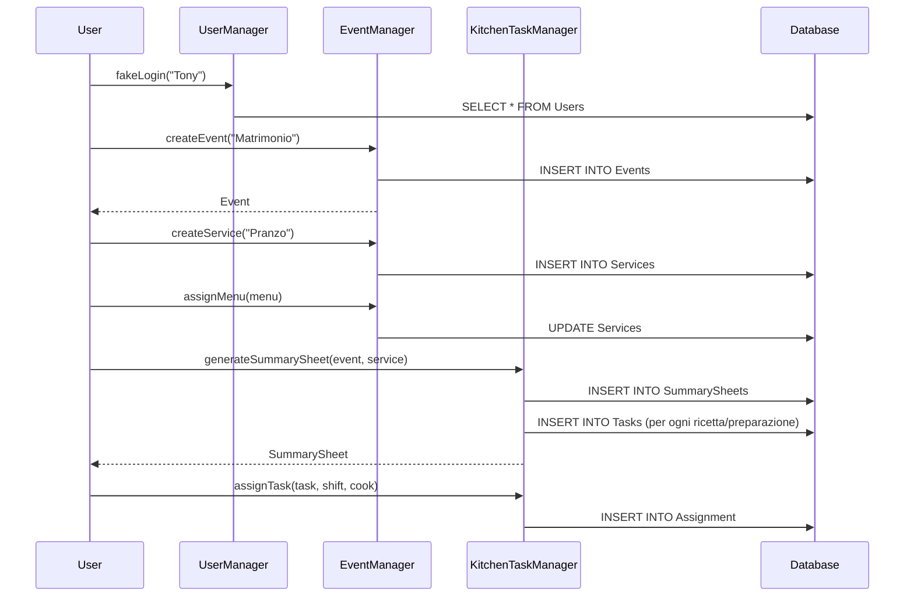

# 🍽️ CatERing - Documentazione Completa del Progetto

> **Sistema di gestione catering per eventi** - Progetto Java/Maven con architettura MVC, SQLite e pattern Observer

---

## 📁 Struttura Top-Down

```
catering/
├── pom.xml                          # Configurazione Maven
├── database/
│   ├── catering.db                  # Database SQLite
│   └── catering_init_sqlite.sql     # Script inizializzazione DB
└── src/main/java/catering/
    ├── businesslogic/
    │   ├── CatERing.java            # ⭐ ENTRY POINT - Singleton principale
    │   ├── UseCaseLogicException.java
    │   ├── event/                   # Gestione eventi e servizi
    │   ├── menu/                    # Gestione menu
    │   ├── recipe/                  # Ricette e preparazioni
    │   ├── kitchen/                 # Fogli riepilogo e task cucina
    │   ├── shift/                   # Turni di lavoro
    │   └── user/                    # Utenti e ruoli
    ├── persistence/                 # Layer di persistenza dati
    └── util/                        # Utility (logging, date)
```

---

## 🏗️ Livello 0: Entry Point

### [CatERing.java](file:///c:/Users/yasse/Desktop/BubbleFolder/SAS/ProgettoSASUfficiale/catering/src/main/java/catering/businesslogic/CatERing.java)

| Aspetto | Descrizione |
|---------|-------------|
| **Pattern** | **Singleton** - unica istanza accessibile globalmente |
| **Ruolo** | Punto di ingresso dell'applicazione, coordina tutti i manager |
| **Main** | Avvia l'app e verifica l'inizializzazione dei manager |

**Componenti gestiti:**
- `MenuManager` → gestione menu
- `RecipeManager` → gestione ricette
- `UserManager` → gestione utenti e login
- `EventManager` → gestione eventi e servizi
- `KitchenTaskManager` → gestione fogli riepilogo e task
- `ShiftManager` → gestione turni di lavoro

**Integrazione:**
```java
// Pattern Observer: collega manager con persistence layer
menuMgr.addEventReceiver(menuPersistence);
kitchenTaskMgr.addEventReceiver(kitchenTaskPersistence);
```

---

### [UseCaseLogicException.java](file:///c:/Users/yasse/Desktop/BubbleFolder/SAS/ProgettoSASUfficiale/catering/src/main/java/catering/businesslogic/UseCaseLogicException.java)

| Aspetto | Descrizione |
|---------|-------------|
| **Tipo** | Eccezione checked |
| **Uso** | Lanciata quando un'operazione viola le regole di business |
| **Esempio** | Utente non autorizzato, evento non selezionato, ecc. |

---

## 📅 Livello 1: Package Event

### [Event.java](file:///c:/Users/yasse/Desktop/BubbleFolder/SAS/ProgettoSASUfficiale/catering/src/main/java/catering/businesslogic/event/Event.java)

| Aspetto | Descrizione |
|---------|-------------|
| **Entità** | Rappresenta un evento (es. matrimonio, conferenza) |
| **Attributi** | `id`, `name`, `dateStart`, `dateEnd`, `chef`, `services` |
| **Relazione** | Un evento contiene **N servizi** |

**Operazioni DB:**
- `saveNewEvent()` - INSERT
- `updateEvent()` - UPDATE  
- `deleteEvent()` - DELETE (cascade sui servizi)
- `loadAllEvents()` - SELECT all
- `loadById()` / `loadByName()` - SELECT singolo

---

### [Service.java](file:///c:/Users/yasse/Desktop/BubbleFolder/SAS/ProgettoSASUfficiale/catering/src/main/java/catering/businesslogic/event/Service.java)

| Aspetto | Descrizione |
|---------|-------------|
| **Entità** | Servizio all'interno di un evento (es. pranzo, cena) |
| **Attributi** | `id`, `name`, `date`, `timeStart`, `timeEnd`, `location`, `eventId`, `menu` |
| **Relazione** | Appartiene a 1 evento, può avere 1 menu assegnato |

**Operazioni chiave:**
- `assignMenuToService(menu)` - assegna menu
- `approveMenu()` - approva il menu per il servizio
- `loadServicesForEvent(eventId)` - carica servizi di un evento

---

### [EventManager.java](file:///c:/Users/yasse/Desktop/BubbleFolder/SAS/ProgettoSASUfficiale/catering/src/main/java/catering/businesslogic/event/EventManager.java)

| Aspetto | Descrizione |
|---------|-------------|
| **Ruolo** | Controller/Facade per operazioni su eventi e servizi |
| **Pattern** | Observer (notifica `EventReceiver` ad ogni modifica) |
| **Stato** | Mantiene `selectedEvent` e `currentService` |

**Operazioni principali:**
- `createEvent()` / `deleteEvent()` - CRUD eventi
- `createService()` / `deleteService()` - CRUD servizi
- `assignMenu()` - assegna menu a servizio
- `selectEvent()` - seleziona evento corrente

---

### [EventReceiver.java](file:///c:/Users/yasse/Desktop/BubbleFolder/SAS/ProgettoSASUfficiale/catering/src/main/java/catering/businesslogic/event/EventReceiver.java)

| Aspetto | Descrizione |
|---------|-------------|
| **Tipo** | Interface (Pattern Observer) |
| **Uso** | Implementata da chi vuole ricevere notifiche su eventi |
| **Metodi** | `updateEventCreated`, `updateServiceCreated`, `updateMenuAssigned`, ecc. |

---

## 🍕 Livello 1: Package Menu

### [Menu.java](file:///c:/Users/yasse/Desktop/BubbleFolder/SAS/ProgettoSASUfficiale/catering/src/main/java/catering/businesslogic/menu/Menu.java)

| Aspetto | Descrizione |
|---------|-------------|
| **Entità** | Menu completo per un servizio |
| **Attributi** | `id`, `title`, `published`, `inUse`, `owner`, `sections`, `freeItems`, `features` |
| **Features** | needsCook, fingerFood, buffet, warmDishes, needsKitchen |

**Struttura gerarchica:**
```
Menu
├── Section[] (sezioni: Antipasti, Primi, ecc.)
│   └── MenuItem[] (voci del menu in sezione)
└── freeItems[] (voci libere senza sezione)
```

**Operazioni chiave:**
- `addSection()` / `removeSection()` - gestione sezioni
- `addItem()` / `removeItem()` - gestione voci
- `getKitchenProcesses()` - estrae tutte le ricette+preparazioni
- `deepCopy()` - copia profonda del menu

---

### [Section.java](file:///c:/Users/yasse/Desktop/BubbleFolder/SAS/ProgettoSASUfficiale/catering/src/main/java/catering/businesslogic/menu/Section.java)

| Aspetto | Descrizione |
|---------|-------------|
| **Entità** | Sezione di un menu (es. "Antipasti", "Primi") |
| **Attributi** | `id`, `name`, `sectionItems[]` |
| **Relazione** | Contiene N `MenuItem` |

---

### [MenuItem.java](file:///c:/Users/yasse/Desktop/BubbleFolder/SAS/ProgettoSASUfficiale/catering/src/main/java/catering/businesslogic/menu/MenuItem.java)

| Aspetto | Descrizione |
|---------|-------------|
| **Entità** | Singola voce del menu |
| **Attributi** | `id`, `description`, `recipe` |
| **Relazione** | Collegata a 1 `Recipe` |

---

### [MenuManager.java](file:///c:/Users/yasse/Desktop/BubbleFolder/SAS/ProgettoSASUfficiale/catering/src/main/java/catering/businesslogic/menu/MenuManager.java)

| Aspetto | Descrizione |
|---------|-------------|
| **Ruolo** | Controller per operazioni sui menu |
| **Stato** | Mantiene `currentMenu` |
| **Validazioni** | Solo chef possono creare/modificare menu |

**Operazioni principali:**
- `createMenu()` / `deleteMenu()` - CRUD
- `defineSection()` / `deleteSection()` - gestione sezioni
- `insertItem()` / `deleteItem()` - gestione voci
- `publish()` - pubblica il menu
- `chooseMenuForCopy()` - copia un menu esistente

---

### [MenuEventReceiver.java](file:///c:/Users/yasse/Desktop/BubbleFolder/SAS/ProgettoSASUfficiale/catering/src/main/java/catering/businesslogic/menu/MenuEventReceiver.java) & [MenuException.java](file:///c:/Users/yasse/Desktop/BubbleFolder/SAS/ProgettoSASUfficiale/catering/src/main/java/catering/businesslogic/menu/MenuException.java)

| File | Descrizione |
|------|-------------|
| `MenuEventReceiver` | Interface Observer per notifiche menu |
| `MenuException` | Eccezione per errori specifici menu (es. menu in uso) |

---

## 🥘 Livello 1: Package Recipe

### [KitchenProcess.java](file:///c:/Users/yasse/Desktop/BubbleFolder/SAS/ProgettoSASUfficiale/catering/src/main/java/catering/businesslogic/recipe/KitchenProcess.java)

| Aspetto | Descrizione |
|---------|-------------|
| **Tipo** | Interface comune per Recipe e Preparation |
| **Metodi** | `getId()`, `getName()`, `isRecipe()`, `getDescription()` |
| **Pattern** | Strategy/Polimorfismo per gestire task uniformemente |

---

### [Recipe.java](file:///c:/Users/yasse/Desktop/BubbleFolder/SAS/ProgettoSASUfficiale/catering/src/main/java/catering/businesslogic/recipe/Recipe.java)

| Aspetto | Descrizione |
|---------|-------------|
| **Entità** | Ricetta completa (es. "Carbonara", "Tiramisù") |
| **Attributi** | `id`, `name`, `description`, `preparations[]` |
| **Relazione** | Una ricetta può richiedere N preparazioni |

**Esempi dal DB:**
- 40 ricette italiane (bruschetta, lasagne, tiramisù, pizza, ecc.)

---

### [Preparation.java](file:///c:/Users/yasse/Desktop/BubbleFolder/SAS/ProgettoSASUfficiale/catering/src/main/java/catering/businesslogic/recipe/Preparation.java)

| Aspetto | Descrizione |
|---------|-------------|
| **Entità** | Preparazione base intermedia |
| **Attributi** | `id`, `name`, `description` |
| **Uso** | Componente riutilizzabile tra ricette |

**Esempi dal DB:**
- 20 preparazioni (ragù, besciamella, pesto, brodo, pasta sfoglia, ecc.)

---

### [RecipeManager.java](file:///c:/Users/yasse/Desktop/BubbleFolder/SAS/ProgettoSASUfficiale/catering/src/main/java/catering/businesslogic/recipe/RecipeManager.java)

| Aspetto | Descrizione |
|---------|-------------|
| **Ruolo** | Facade semplice per accedere al ricettario |
| **Metodo** | `getRecipeBook()` - ritorna tutte le ricette |

---

## 👨‍🍳 Livello 1: Package Kitchen

### [SummarySheet.java](file:///c:/Users/yasse/Desktop/BubbleFolder/SAS/ProgettoSASUfficiale/catering/src/main/java/catering/businesslogic/kitchen/SummarySheet.java)

| Aspetto | Descrizione |
|---------|-------------|
| **Entità** | Foglio riepilogo per organizzare la cucina di un servizio |
| **Attributi** | `id`, `service`, `owner`, `taskList[]`, `assignmentList[]` |
| **Creazione** | Genera automaticamente task dal menu del servizio |

**Funzionalità chiave:**
- Generato automaticamente dal menu del servizio
- Contiene tutti i KitchenTask da eseguire
- Gestisce le assegnazioni a cuochi/turni

---

### [KitchenTask.java](file:///c:/Users/yasse/Desktop/BubbleFolder/SAS/ProgettoSASUfficiale/catering/src/main/java/catering/businesslogic/kitchen/KitchenTask.java)

| Aspetto | Descrizione |
|---------|-------------|
| **Entità** | Singolo compito da eseguire in cucina |
| **Attributi** | `id`, `description`, `kitchenProcess`, `quantity`, `portions`, `ready`, `type` |
| **Relazione** | Collegato a 1 `KitchenProcess` (Recipe o Preparation) |

---

### [Assignment.java](file:///c:/Users/yasse/Desktop/BubbleFolder/SAS/ProgettoSASUfficiale/catering/src/main/java/catering/businesslogic/kitchen/Assignment.java)

| Aspetto | Descrizione |
|---------|-------------|
| **Entità** | Assegnazione di un task a un cuoco in un turno |
| **Attributi** | `id`, `task`, `shift`, `cook` |
| **Vincolo** | Il cuoco deve essere disponibile nel turno |

---

### [KitchenTaskManager.java](file:///c:/Users/yasse/Desktop/BubbleFolder/SAS/ProgettoSASUfficiale/catering/src/main/java/catering/businesslogic/kitchen/KitchenTaskManager.java)

| Aspetto | Descrizione |
|---------|-------------|
| **Ruolo** | Controller per operazioni di cucina |
| **Stato** | Mantiene `currentSumSheet` |
| **Validazioni** | Solo chef può generare fogli riepilogo |

**Operazioni principali:**
- `generateSummarySheet()` - crea foglio da evento+servizio
- `addKitchenTask()` / `moveTask()` - gestione task
- `assignTask()` / `modifyAssignment()` / `deleteAssignment()` - gestione assegnazioni
- `setTaskReady()` - marca task come completato
- `addTaskInformation()` - aggiunge quantità/porzioni

---

### [KitchenTaskEventReceiver.java](file:///c:/Users/yasse/Desktop/BubbleFolder/SAS/ProgettoSASUfficiale/catering/src/main/java/catering/businesslogic/kitchen/KitchenTaskEventReceiver.java) & [SummarySheetException.java](file:///c:/Users/yasse/Desktop/BubbleFolder/SAS/ProgettoSASUfficiale/catering/src/main/java/catering/businesslogic/kitchen/SummarySheetException.java)

| File | Descrizione |
|------|-------------|
| `KitchenTaskEventReceiver` | Interface Observer per notifiche kitchen |
| `SummarySheetException` | Eccezione per errori specifici (es. assignment non valido) |

---

## ⏰ Livello 1: Package Shift

### [Shift.java](file:///c:/Users/yasse/Desktop/BubbleFolder/SAS/ProgettoSASUfficiale/catering/src/main/java/catering/businesslogic/shift/Shift.java)

| Aspetto | Descrizione |
|---------|-------------|
| **Entità** | Turno di lavoro |
| **Attributi** | `id`, `date`, `startTime`, `endTime`, `bookedUsers` |
| **Uso** | Per assegnare cuochi ai task |

**Operazioni chiave:**
- `addBooking(user)` - prenota utente per turno
- `removeBookedUser(user)` - rimuove prenotazione
- `isBooked(user)` - verifica disponibilità

---

### [ShiftManager.java](file:///c:/Users/yasse/Desktop/BubbleFolder/SAS/ProgettoSASUfficiale/catering/src/main/java/catering/businesslogic/shift/ShiftManager.java)

| Aspetto | Descrizione |
|---------|-------------|
| **Ruolo** | Facade per operazioni sui turni |
| **Metodi** | `getShiftTable()`, `isAvailable()`, `createShift()`, `bookUserForShift()` |

---

## 👤 Livello 1: Package User

### [User.java](file:///c:/Users/yasse/Desktop/BubbleFolder/SAS/ProgettoSASUfficiale/catering/src/main/java/catering/businesslogic/user/User.java)

| Aspetto | Descrizione |
|---------|-------------|
| **Entità** | Utente del sistema |
| **Attributi** | `id`, `username`, `roles` |
| **Ruoli** | `CUOCO`, `CHEF`, `ORGANIZZATORE`, `SERVIZIO` |

**Metodi utili:**
- `isChef()` / `isCook()` - verifica ruolo
- `addRole()` / `removeRole()` - gestione ruoli

---

### [UserManager.java](file:///c:/Users/yasse/Desktop/BubbleFolder/SAS/ProgettoSASUfficiale/catering/src/main/java/catering/businesslogic/user/UserManager.java)

| Aspetto | Descrizione |
|---------|-------------|
| **Ruolo** | Gestione sessione utente |
| **Stato** | Mantiene `currentUser` |
| **Metodo** | `fakeLogin(username)` - simula login |

---

## 💾 Livello 1: Package Persistence

### [PersistenceManager.java](file:///c:/Users/yasse/Desktop/BubbleFolder/SAS/ProgettoSASUfficiale/catering/src/main/java/catering/persistence/PersistenceManager.java)

| Aspetto | Descrizione |
|---------|-------------|
| **Ruolo** | **Core della persistenza** - gestisce tutte le operazioni DB |
| **Database** | SQLite (`database/catering.db`) |
| **Pattern** | Singleton implicito (metodi statici) |

**Metodi principali:**
- `executeQuery(query, handler, params...)` - SELECT con parametri
- `executeUpdate(update, params...)` - INSERT/UPDATE/DELETE
- `executeBatchUpdate(query, count, handler)` - batch operations
- `getLastId()` - ottiene ID dell'ultimo INSERT
- `initializeDatabase()` - esegue script SQL di init

---

### [MenuPersistence.java](file:///c:/Users/yasse/Desktop/BubbleFolder/SAS/ProgettoSASUfficiale/catering/src/main/java/catering/persistence/MenuPersistence.java)

| Aspetto | Descrizione |
|---------|-------------|
| **Pattern** | Implementa `MenuEventReceiver` (Observer) |
| **Ruolo** | Sincronizza modifiche menu con DB |
| **Come** | Ogni metodo `updateXxx` chiama la corrispondente operazione DB |

---

### [KitchenTaskPersistence.java](file:///c:/Users/yasse/Desktop/BubbleFolder/SAS/ProgettoSASUfficiale/catering/src/main/java/catering/persistence/KitchenTaskPersistence.java)

| Aspetto | Descrizione |
|---------|-------------|
| **Pattern** | Implementa `KitchenTaskEventReceiver` (Observer) |
| **Ruolo** | Sincronizza modifiche kitchen con DB |

---

### [BatchUpdateHandler.java](file:///c:/Users/yasse/Desktop/BubbleFolder/SAS/ProgettoSASUfficiale/catering/src/main/java/catering/persistence/BatchUpdateHandler.java) & [ResultHandler.java](file:///c:/Users/yasse/Desktop/BubbleFolder/SAS/ProgettoSASUfficiale/catering/src/main/java/catering/persistence/ResultHandler.java)

| File | Descrizione |
|------|-------------|
| `BatchUpdateHandler` | Interface per gestire batch INSERT e generated IDs |
| `ResultHandler` | Interface callback per processare righe di ResultSet |

---

## 🛠️ Livello 1: Package Util

### [LogManager.java](file:///c:/Users/yasse/Desktop/BubbleFolder/SAS/ProgettoSASUfficiale/catering/src/main/java/catering/util/LogManager.java)

| Aspetto | Descrizione |
|---------|-------------|
| **Pattern** | Singleton per logging centralizzato |
| **Uso** | `LogManager.getLogger(Class)` - ottiene logger formattato |
| **Formato** | `timestamp [LEVEL] className: message` |

---

### [DateUtils.java](file:///c:/Users/yasse/Desktop/BubbleFolder/SAS/ProgettoSASUfficiale/catering/src/main/java/catering/util/DateUtils.java)

| Aspetto | Descrizione |
|---------|-------------|
| **Ruolo** | Utility per conversione date SQLite ↔ Java |
| **Metodi** | `getDateFromResultSet()`, `safeValueOf()` |
| **Problema risolto** | SQLite non ha tipo DATE nativo |

---

## 🗄️ Database Schema



---

## 🔄 Flusso Tipico



---

## ▶️ Come Eseguire

```bash
# 1. Compila
mvn compile

# 2. Esegui
mvn exec:java

# 3. Test
mvn test
```
