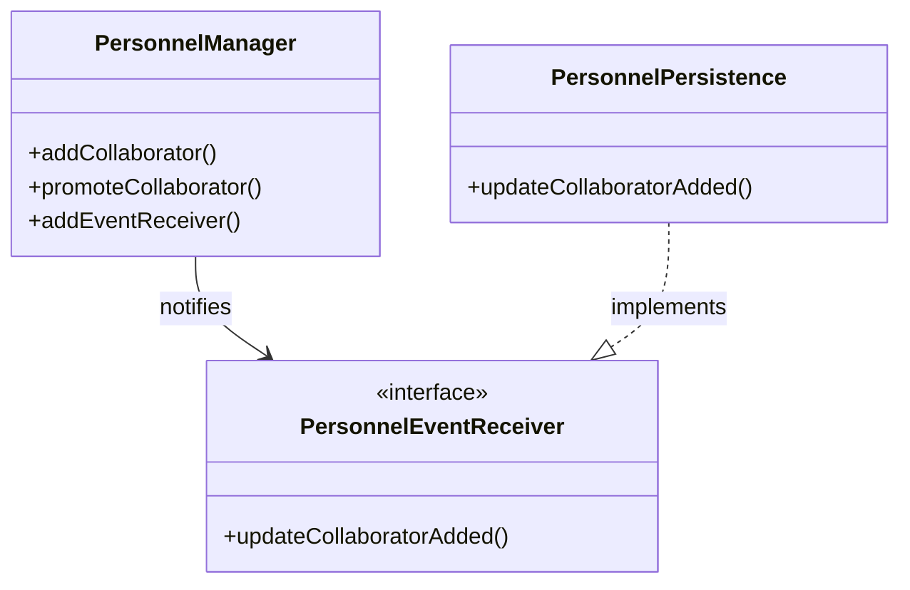

# 📋 Gestione Personale - Walkthrough Tecnico

> **Stato**: Completato (20/20 Test Unitari, 9/9 Test Integrazione)
> **Branch**: develop/personnel-management

Questo documento descrive l'implementazione tecnica del modulo **Gestione del Personale** (UC d'esame).

## 1. Mappatura File Implementati

| Componente | File Sorgente (`src/main/java/...`) | Ruolo |
|------------|-----------------------------------|-------|
| **Entity** | `catering.businesslogic.personnel.Collaborator` | Mappa entità `Collaboratore` |
| **Entity** | `catering.businesslogic.personnel.LeaveRequest` | Mappa entità `RichiestaFerie` |
| **Entity** | `catering.businesslogic.personnel.PerformanceNote` | Mappa entità `Performance` |
| **Controller**| `catering.businesslogic.personnel.PersonnelManager` | Logica applicativa e security |
| **Persistence**| `catering.persistence.PersonnelPersistence` | Connessione al DB (Observer pattern) |
| **Security** | `catering.businesslogic.user.User` | Aggiunto ruolo `PROPRIETARIO` (id=4) |

## 2. Architettura & Design Patterns

### Pattern Controller & Observer
Come per gli altri moduli (Menu, Event), abbiamo usato un Manager che fa da Subject per la persistenza:


### Pattern Security (Role-Based)
I permessi sono verificati programmaticamente dentro `PersonnelManager`:
- **Owner (Giovanni)**: Può aggiungere, promuovere, approvare ferie.
- **Organizer (Tutti)**: Possono modificare info, loggare performance, rimuovere (soft-delete).
- **Cook/Staff**: Nessun accesso in scrittura.

## 3. Guida ai Test

### Unit Tests (`PersonnelTest.java`)
Testano la logica pura senza database reale (o con DB in-memory simulato).
- Verificano: calcolo date ferie, transizioni di stato (occasionale->permanente), soft-delete.

### Integration Tests (`PersonnelIntegrationTest.java`)
**Cruciali per l'esame**. Eseguono un login simulato (`fakeLogin`) per testare le eccezioni di sicurezza.
- `testAddCollaborator_AsOrganizer_Fails`: Verifica che Marinella non possa aggiungere gente.
- `testAddCollaborator_AsOwner_Success`: Verifica che Giovanni possa farlo.

## 4. Database Schema (SQLite)

```sql
-- Collaboratori
CREATE TABLE Collaborators (
    id INTEGER PRIMARY KEY,
    name TEXT,
    occasional INTEGER, -- 1=Si, 0=No
    active INTEGER,     -- Soft Delete
    vacation_days INTEGER,
    user_id INTEGER     -- Link opzionale a User sistema
);

-- Ferie
CREATE TABLE LeaveRequests ( ... );

-- Performance
CREATE TABLE PerformanceNotes ( ... );
```

## 5. Istruzioni per Esecuzione

```bash
# Compilazione e Test Completi
mvn clean test

# Esecuzione solo Test Integrazione (Scenario Reale)
mvn test -Dtest=PersonnelIntegrationTest
```
