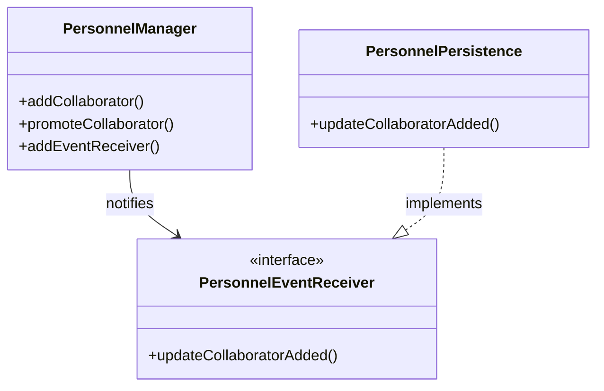

# 📋 Gestione Personale - Walkthrough Tecnico

> **Stato**: Completato (27 Test Totali: Unit, Integration, Stress)
> **Ultimo aggiornamento**: 2026-01-18

Questo documento descrive l'implementazione tecnica del modulo **Gestione del Personale** (UC d'esame).

## 1. Mappatura File Implementati

| Componente | File Sorgente (`src/main/java/...`) | Ruolo |
|------------|-----------------------------------|-------|
| **Entity** | `catering.businesslogic.personnel.Collaborator` | Mappa entità `Collaboratore` |
| **Entity** | `catering.businesslogic.personnel.LeaveRequest` | Mappa entità `RichiestaFerie` |
| **Entity** | `catering.businesslogic.personnel.PerformanceNote` | Mappa entità `Performance` |
| **Controller**| `catering.businesslogic.personnel.PersonnelManager` | Logica applicativa e security |
| **Persistence**| `catering.persistence.PersonnelPersistence` | Connessione al DB (Observer pattern) |
| **Security** | `catering.businesslogic.user.User` | Aggiunto ruolo `PROPRIETARIO` (id=4) |

## 2. Validazioni Logiche Implementate

### 🛡️ Controllo Nomi Duplicati
`Collaborator.create()` impedisce la creazione di collaboratori con nome identico a uno già attivo.

### 📅 Controllo Ferie Sovrapposte
`LeaveRequest.save()` impedisce il salvataggio di richieste che si sovrappongono a ferie già approvate.

### 🔒 Controllo Turni Futuri
`Collaborator.deactivate()` impedisce la disattivazione se il collaboratore ha turni futuri confermati in `CollaboratorAvailability`.

## 3. Architettura & Design Patterns

### Pattern Controller & Observer
Come per gli altri moduli (Menu, Event), abbiamo usato un Manager che fa da Subject per la persistenza:


### Pattern Security (Role-Based)
I permessi sono verificati programmaticamente dentro `PersonnelManager`:
- **Owner (Giovanni)**: Può aggiungere, promuovere, approvare ferie.
- **Organizer (Tutti)**: Possono modificare info, loggare performance, rimuovere (soft-delete).
- **Cook/Staff**: Nessun accesso in scrittura.

## 4. Guida ai Test

### Unit Tests (`PersonnelTest.java`)
Testano la logica pura con DB in-memory.

### Integration Tests (`PersonnelIntegrationTest.java`)
Eseguono un login simulato (`fakeLogin`) per testare le eccezioni di sicurezza.

### Stress Tests (`PersonnelStressTest.java`)
Testano scenari limite: ferie sovrapposte, eliminazione con turni, nomi duplicati.

## 5. Istruzioni per Esecuzione

```bash
# Compilazione e Test Completi
mvn clean test

# Esecuzione solo Test Stress
mvn test -Dtest=PersonnelStressTest
```
